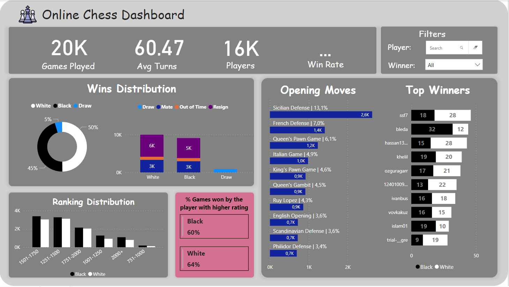
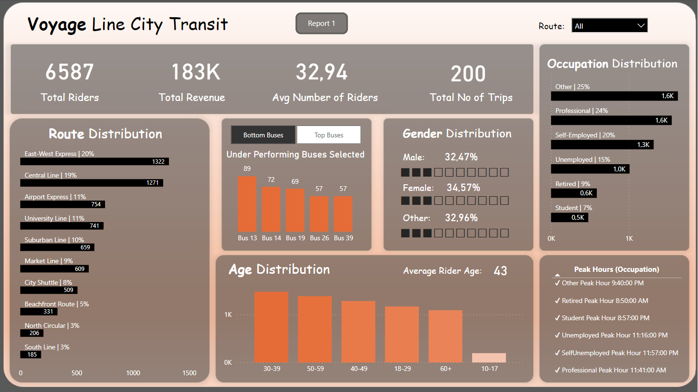
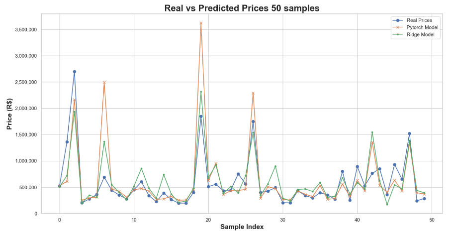
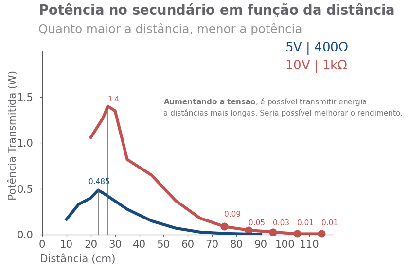

# Bem-vindo(a) ao meu Portfólio de Análise e Ciência de Dados!

Eng Portfolio: https://github.com/GustavoG-bot/portfolio_eng

# Power BI

## Painel de Xadrez

### Visão Geral

Este painel apresenta insights de um conjunto de dados com mais de 20.000 partidas de xadrez online jogadas no Lichess. O conjunto de dados inclui informações detalhadas, como movimentos, vencedor, classificação e detalhes de abertura.

### Detalhes do Conjunto de Dados

**Partidas de Xadrez Online**
- Dados de mais de 20.000 partidas de xadrez jogadas no Lichess, incluindo movimentos, vencedor, classificação, detalhes de abertura e mais.

### Análise

1. **Estatísticas de Vitória:**
   - Qual a porcentagem de partidas vencidas por brancas? Quantas terminaram em empate?

2. **Movimentos de Abertura:**
   - Qual movimento de abertura foi mais frequentemente usado em partidas em que as peças pretas venceram? E quando as brancas venceram?

3. **Influência da Classificação:**
   - Qual a porcentagem de partidas vencidas pelo jogador com a classificação mais alta? Isso varia de acordo com a cor das peças?

4. **Análise dos Melhores Jogadores:**
   - Qual usuário venceu a maior quantidade de partidas? Em que porcentagem dessas partidas o usuário era o jogador com a classificação mais alta?

Sinta-se à vontade para explorar e visualizar os dados usando o painel para obter mais insights: https://app.powerbi.com/groups/me/reports/5ffa5a4b-f3fb-43af-b6f6-5c89dfac3e09/ReportSection?experience=power-bi

---

## Painel de Transporte

### Visão Geral

Este painel fornece uma análise abrangente do setor de transporte na cidade. Ele abrange detalhes como ocupação de ônibus, rotas populares, demografia de passageiros e horários de pico.

### Detalhes do Conjunto de Dados

**Dados de Transporte da Cidade**
- Informações sobre ocupação de ônibus, rotas, demografia de passageiros e horários.

### Análise

1. **Ocupação de Ônibus:**
   - Identificar os ônibus mais e menos ocupados.

2. **Análise de Rotas:**
   - Determinar as rotas mais movimentadas e menos movimentadas na cidade.

3. **Demografia de Passageiros:**
   - Explorar a distribuição de idade e ocupação (trabalho) entre os passageiros para entender o público-alvo.

4. **Horários de Pico:**
   - Identificar os horários mais movimentados e menos movimentados durante o dia.

Sinta-se à vontade para usar os recursos interativos do painel para aprofundar sua compreensão nos dados de transporte: https://app.powerbi.com/groups/me/reports/e24ec4dc-153a-4f17-a636-0cd060aa7b93/ReportSection3944d937f29d2cc50171?experience=power-bi

---

# Python

## Projeto de Previsão de Preços e Web Scraping

Análise Preditiva do Preço de Imóveis

## Visão Geral

Este projeto envolve o uso da Automação de Processos Robóticos (RPA) com o UiPath para realizar web scraping, extrair dados imobiliários e posteriormente utilizar técnicas de ciência de dados para análise e previsão. Os objetivos principais incluem coleta de dados, limpeza, exploração e construção de um modelo preditivo para estimar os preços de propriedades com base em diversas características como número de quartos, tipo de propriedade, vagas de estacionamento e metragem quadrada.

## Descrição do Projeto

### Web Scraping com UiPath

Utilizando as capacidades de RPA do UiPath, o projeto inicia com web scraping para reunir dados imobiliários de fontes online. O UiPath é utilizado para navegar por páginas da web, extrair informações relevantes e armazená-las em um formato estruturado.

### Transformação de Dados com Excel

Os dados extraídos são transferidos para uma planilha do Excel para processamento adicional. Esta etapa envolve organizar e formatar os dados para prepará-los para análises subsequentes.

### Limpeza e Exploração de Dados

Com os dados agora em um formato utilizável, o projeto procede à limpeza e exploração do conjunto de dados. Isso envolve lidar com valores ausentes, outliers e outras inconsistências. Análise exploratória de dados (EDA) é realizada para obter insights sobre a distribuição e relacionamentos dentro do conjunto de dados.

### Modelagem Preditiva com PyTorch

O núcleo do projeto envolve a construção de um modelo preditivo usando o PyTorch, um framework de aprendizado profundo. Uma rede neural é projetada e treinada para prever os preços de propriedades com base em características-chave, como número de quartos, tipo de propriedade, vagas de estacionamento e metragem quadrada.

### Comparação de Modelos

Além da rede neural, um modelo de regressão pré-treinado é utilizado para análise comparativa. O desempenho de ambos os modelos é avaliado para determinar sua eficácia na previsão de preços imobiliários.

Veja o repositório em: https://github.com/GustavoG-bot/quinto_andartrain

---

## Projeto de Transferência de Potência sem Fio (WPT) - Acoplamento Ressonante Indutivo

## Visão Geral

A Transferência de Potência sem Fio (WPT), ou Transferência de Potência via Wireless, é um sistema de transmissão de energia elétrica sem o uso de fios. A transferência de energia ocorre por meio de um campo magnético variante no tempo, gerado por um circuito transmissor e recebido por um dispositivo receptor que se deseja carregar.

Neste projeto, foi estudado uma tecnologia específica de WPT, conhecida como Acoplamento Ressonante Indutivo. Esse sistema opera de maneira semelhante a um transformador, onde há duas bobinas separadas. A bobina do primário, por meio de uma fonte de tensão, transfere energia para o secundário, onde há uma carga acoplada. A diferença do WPT em relação ao transformador é a presença de capacitores no primário e no secundário, juntamente com as autoindutâncias das bobinas, tornando o sistema oscilante para uma determinada frequência de ressonância. Essa frequência deve ser a mesma para ambos transmissor e receptor. Se o sistema oscilar na frequência de ressonância por meio de uma ação forçada, haverá transferência de energia.

Durante a execução deste projeto, as seguintes tarefas foram realizadas:

1. Adaptação do modelo de transformador para o estudo do circuito WPT ressonante;
2. Simulação do modelo do circuito WPT em Python e identificação da frequência de transmissão ótima para cada condição de carga e coeficiente de acoplamento magnético;
3. Montagem de um circuito WPT capaz de transmitir energia sem fios para uma aplicação escolhida;
4. Apresentação dos resultados das simulações e validações.

Veja o repositório do projeto em: https://github.com/GustavoG-bot/WPTeletromag

Veja mais projetos de python em:
- Jogo de pygame: https://github.com/GustavoG-bot/projetogamedessoft 
- Predição de níveis de radiação solar: https://github.com/GustavoG-bot/projeto2data
- Explore meus repositórios para mais projetos!

--- 

# SQL 

## Projeto de Análise da Base de Dados Sakila

Este projeto utiliza a base de dados "sakila" para realizar análises e responder a diversas perguntas relacionadas à locadora de filmes. A base de dados "sakila" contém informações sobre filmes, clientes, pagamentos, atores e outras entidades relacionadas a uma locadora fictícia.

## Perguntas Respondidas

1. **Número de Filmes Alugados por Categoria e Receita Total:**
   - Apresenta o número total de filmes alugados por categoria, juntamente com a receita total gerada por esses aluguéis.

2. **Clientes que Mais Gastaram na Locadora:**
   - Identifica os clientes que mais gastaram com a loja, listando seus nomes, sobrenomes e o total pago.

3. **Atores/Atrizes cujo Nome Inicia com "A":**
   - Lista os atores e atrizes cujos nomes começam com a letra "A".

4. **Número de Filmes por Ator:**
   - Apresenta o número total de filmes em que cada ator atuou.

5. **Número de Filmes por Ator com Filtro:**
   - Filtra os atores que participaram de 35 ou mais filmes, apresentando seus nomes e o total de filmes.

6. **Quantidade de Filmes por Estoque:**
   - Mostra a quantidade de filmes disponíveis em cada estoque, juntamente com os títulos dos filmes.

7. **Top Clientes por Categoria Específica:**
   - Identifica os principais clientes que alugaram filmes da categoria 'Action', listando seus IDs, nomes e o total de aluguéis.

## Código (SQL)

Disponível no repositório: https://github.com/GustavoG-bot/sql_train/tree/main

---

# RPA

Robôs desenvolvidos usando software de automação chamado UiPath. Robôs disponíveis no link: https://drive.google.com/drive/folders/1z1asixySCBIEPo7rdZiDt7rKl1lYAnrJ

Exemplo: (colocar video do web scraping real estate)

--- 

# SOBRE

Olá! 😊

Sou um estudante de Engenharia Mecatrônica no Insper, atualmente cursando o nono semestre. Desde o início da minha jornada acadêmica, tenho sido impulsionado por explorar diferentes áreas da engenharia, sendo todas relacionadas a áreas que meu curso aborda, como programação, robótica, elétrica/eletrônica, teoria de controle, mecânica, dentre outras. 

Veja também meu portfólio de alguns projetos nesssas áreas: https://drive.google.com/drive/folders/1Fl73x_nhXwF1cUF_o1W-frHUlm11oCJU?usp=sharing

--- 

# CONTATO

Se você tiver alguma pergunta, comentário ou desejar entrar em contato comigo, sinta-se à vontade para fazê-lo por meio dos links abaixo:

- Linkedin: https://www.linkedin.com/in/gustavo-camargoin/ 
- Github: https://github.com/GustavoG-bot
- Kaggle: https://www.kaggle.com/guedes5132
